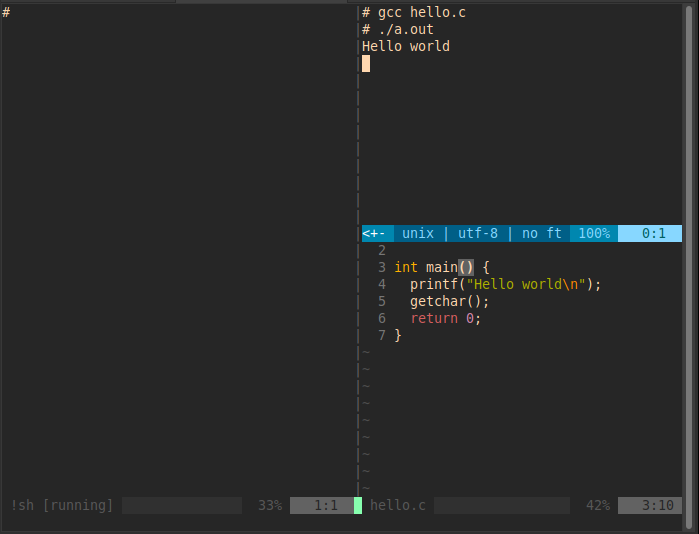
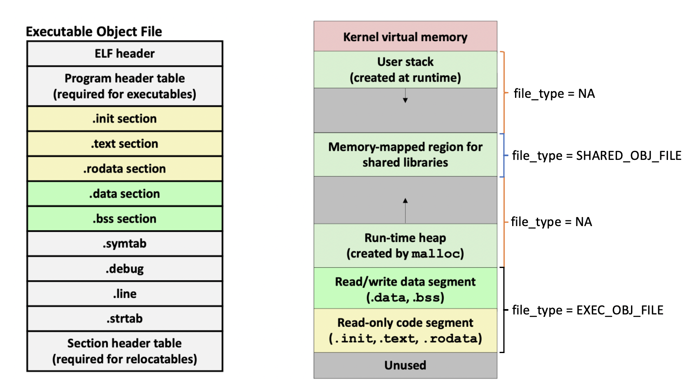

# Lab 06

In this lab, we will explore virtual memory mappings. In general, you will write a file parser that outlines how virtual memory is mapped to a real program that is running in memory! In addition to reinforcing concepts from previous labs, this lab also emphasizes these concepts learned in the course:
* C Language Concepts
  * Structs
  * Interfaces (Headers)
  * Pointers (Passing Values by Reference)
* System Concepts
  * Virtual memory and pages
  * Executable and linkable format (ELF)
  * Executable object file 
  * Shared object file 
  * Dynamic and static linking

### Reading
- C Programming Language:
  - *Enumerations* - Chapter 2 (end of section 2.4)
  - *Pointers and arrays* Chapter 5
- Refer to the following for a review on programming concepts and virtual memory
  - [Programming Concepts lecture slides](https://sakai.unc.edu/access/content/group/bcb48c3b-5188-4ec4-ac95-ac2b53652fc7/Lecture%20Slides/ProgrammingConcepts.pdf)
  - [Memory Organization lecture slides](https://sakai.unc.edu/access/content/group/bcb48c3b-5188-4ec4-ac95-ac2b53652fc7/Lecture%20Slides/Memory_Organization.pdf)
  - [System and linking supplemental reading](https://sakai.unc.edu/access/content/group/bcb48c3b-5188-4ec4-ac95-ac2b53652fc7/Readings/System_and_Linking.pdf) 
  	- Section 1.7.3: Virtual Memory
  	- Section 7.4: Relocatable Object Files
  	- Section 7.9: Loading Executable Object Files
  - [Virtual memory supplemental reading](https://sakai.unc.edu/access/content/group/bcb48c3b-5188-4ec4-ac95-ac2b53652fc7/Readings/Virtual_Memory.pdf) 
  	- Section 9.7.2: Linux Virtual Memory System 
  	- Section 9.8.1: Shared Objects Revisited
  	- Section 9.8.4: User-level Memory Mapping with the mmap Function

### File Structure
Three files are included in this lab: 
* `parse.c` - This is where you will implement the functionality outlined in [Part 1](#part-1-parsing-a-line-in-the-maps-file) and [Part 2](#part-2-parsing-the-entire-maps-file).
* `parse_functions.h` - function prototypes. **Do not modify.**
* `parse_objects.h` - defintition of the *memmap* struct and the *ProcSection* and *FileType* enum types. **Do not modify.**

### Honor Code Header
Please include the honor code header at the top of the `parse.c` file.  Since we do grade manually for style we do not include names on code listings to avoid biasing the grading.
```
// PID: 9DigitPidNoSpacesOrDashes
// I pledge the COMP211 honor code.
```

### Linux System: Virtual memory and the maps file
A process is a running program. Every process has its own virtual memory address space, which then gets mapped by the memory management unit (MMU) of the computer to physical memory.

In unix systems, the `/proc` folder contains information about processes. In `/proc`, you'll usually find many directories with unique integer names. These integers correspond directly to the process ids of running processes on your system. If you run `ls /proc` on learncli, you'll probably only see three such folders since there isn't much running on the system. We'll denote a proc folder for a process with process id `<PID>` by `/proc/<PID>/`.

There are many directories within a `/proc/<PID>/` directory, but for this lab we are just interested in the `/proc/<PID>/maps` file which will give us all the memory mappings for the process with process id `<PID>`. You can see more about the different `/proc/<PID>/` subfolders and the maps file on the man page by typing `man proc`. For convenience, some of this information is reproduced below.

The `/proc/<PID>/maps` file will have the following layout:
```
    address           perms offset  dev   inode       pathname
    00400000-00452000 r-xp 00000000 08:02 173521      /usr/bin/dbus-daemon
    00651000-00652000 r--p 00051000 08:02 173521      /usr/bin/dbus-daemon
    00652000-00655000 rw-p 00052000 08:02 173521      /usr/bin/dbus-daemon
    00e03000-00e24000 rw-p 00000000 00:00 0           [heap]
    ...
    35b1800000-35b1820000 r-xp 00000000 08:02 135522  /usr/lib64/ld-2.15.so
```
This file contains the memory map of a single process. We'll only be concerned with knowledge of the following fields for this lab:
- `address` contains the address range.
- `pathname` has the name of what is stored at that address name, this could be an area of the program like a heap or stack, or an external library. If the pathname is blank, that means that the `mmap` program on your OS wasn't able to easily trace what part of the process allocated the memory. We'll ignore these unlabeled regions.
- `perms` has the permissions allowed for that region of memory, read (r), write (w), and/or execute (x).
	
   Permissions are a security measure that restrict the OS to only do certain operations on the memory. For example, `r--` permissions means that the memory can only be read, not modified or executed and `r-x` means that the memory can be read and executed as a program, but not modified, and `rw-` means that the memory can be read and written to, but not executed.
   
   Technically, computers would still work even if all memory had all permissions, but in practice we try to make sure that all memory regions only have the lowest amount of permissions necessary for expected operation.

## Part 0: Viewing the maps file of our own process
(**Note:** This part is optional, but it's fun and it will help your understanding for the rest of the lab)

Programs only get allocated memory when they are running! Let's create a process and check out its virtual memory mappings defined in the maps file.

1. Start up your learncli shell
2. Clone this repository and enter the directory
3. Create a file called hello.c and enter the following code:
```
#include <stdio.h>

int main() {
  printf("Hello world\n");
  getchar(); 
  return 0;
}
```
When you run the above code it will wait for you to feed it a character and terminate. We're going to run the program and leave it running while we examine 
the process in another terminal.
Since we can't open multiple terminals with the same docker process, we'll use vim terminals. See the section below for the specifics of creating and navigating vim terminal windows.

- Create a vertical terminal with `:vert term`, then go back to the window with the code and create a horizontal terminal with `:term`
- Your layout should look like this:

  

In the top right corner, compile and run the code as shown in the image.
- Next navigate to the leftmost terminal window and run `ps -e`. This will list all the processes running on your image.
- Notice that you can see both the a.out process and the vim process that you're using!
- From the `ps -e` command we can see the process id of the process running our `a.out` binary. 
  You can look at the maps file with the command `cat /proc/<PID>/maps` or simply open that file in a new vim tab: `tabe /proc/<PID>/maps`.

Congratulations! You now know how to create your own process and view it's virtual memory map on a Linux system! 

### Vim Terminals and Windows
- `:term` or `:terminal` to open a terminal horizontally
- `:vert term` or `:vertical terminal` to open a terminal vertically
- Before you use any vim commands in a terminal pane, you'll have to use the window command `ctrl + w`.
    - For example to quit a terminal you would press `ctrl+w` and then type `:q!`
- To switch between different window panes, press `ctrl + w` and then either `h`, `j`, `k`, or `l`, depending on which direction you want to go.
(If you press `ctrl` + `w` plus a direction simultaneously it might not work)
- To quit a terminal, you always have to use the `:q!` command, just `:q` will not work.

## Part 1: Parsing a line in the maps file

In parts 1.A, 1.B, and 1.C you will provide some basic utility functions to gather information based on the maps file we looked at above.

#### Provided struct and enumerations

In `parse_objects.h`, we have provided a struct `memmap` which contains information about a memory mapping from one line of the maps file:
```
enum ProcSection {STACK, SHAREDLIB, HEAP, TEXT, RODATA, DATA};
enum FileType {SHARED_OBJ_FILE, EXEC_OBJ_FILE, NA};

typedef struct memmap{
    // provided parameters parsed from the proc file
    char* name;
    int start_addr;
    int end_addr; 
    char r, w, x; 
    // you populate these:
    int length;
    enum ProcSection section;
    enum FileType file_type;
} memmap;
```
#### Provided functions

Additionally, we have provided functions called 
- `pprint`: prints out the struct in a nice format.
- `parseline`: Fills in a memmap struct according to one line from a `/proc/<PID>/maps` file
- `populate_mmap`: Returns an array of memmaps when fed a `/proc/<PID>/maps` file from stdin.
- `size_of_memmap_array`: Returns how many memmaps are in an array of memmap.

The provided `main` function in the starter code shows how these work together:
```
int main(){
    memmap* maps = populate_mmap();
    int size = size_of_memmap_array(maps);
    
    for (int i=0; i<5; i++){
        pprint(maps[i]);
    }
    return 0;
}
```
When you run `gcc parse.c; cat <proc maps file> | ./a.out`, the above code will print out the structs corresponding to the first five lines of `<proc maps file>`. Verify that this is true!

#### Part 1.A: Memory mapping length
Notice at the end of `parse_line`, there is a call to `memmap_size`. Uncomment it and implement the `memmap_size` function, which takes in a single memmap struct and returns the length of its address range (the total amount of bytes in the address range). Note this should only take one or two lines of code.


#### Part 1.B: Program Sections
At the end of the `populate_mmap` function, you will also notice there is a call to`assign_sections` which has not been implemented yet. The function takes an array of memmaps as the parameter. For each memmap in the array you need to determine its section label and set the memmap structs `section` field to the value you've determined.

The `section` field of the struct is one of the following enum types, which correspond to the program sections shown in the image below:
```
enum ProcSection {STACK, SHAREDLIB, HEAP, TEXT, RODATA, DATA};
```

  
  
> Note that the picture on the right shows the lowest addresses on the bottom and the highest on the top, whereas the proc maps file shows the lowest address-ranges first.

Each memmory mapping should have its `section` field set to exactly one of the values shown in the `ProcSection` enum.

The following information should help you determine what to label each mapping.
- The STACK and HEAP program section can be determined soley from the mapping name (`[stack]` or `[heap]`). 
- Shared libraries (SHAREDLIB) will always be between the heap and the stack and should have a `.so` for shared object in their mapping name.
- In an array of memmaps, there should only at most one TEXT, one RODATA, and one DATA program section. All of these mappings will share the same `name` field.
  - The TEXT section has `r-x` permissions
  - The RODATA section has `r--` permissions
  - The DATA section has `rw-` permissions
   
    Though there are sections of shared libraries that also have these permissions, these sections correspond to the original binary file that was executed, not the libraries that were linked to the program. Unlike shared libraries, these sections will always have an address range lower than the heap.

*Hint*: Look at some of the sample proc maps files provided in the `sample-proc-maps` directory. Determine what `ProcSection` enum type each line in the file corresponds to. Next write the `assign_secions` function as specified in `parse_functions.h` to do the same thing but with C code instead of your brain.


#### Part 1.C: File Types
At the end of the `populate_mmap` function, there is also a call to`assign_filetypes` which has not been implemented yet. Like `assign_section`, it takes an array of memmaps as the parameter. For each memmap in the array you need to determine it's file type and set the memmap structs `file_type` field to the value you've determined.

Files can be either executable objects, shared objects, or relocatable objects. Since relocatable object files aren't relevant for a running program, a memory mapping can have one of the following types:
```
enum FileType {SHARED_OBJ_FILE, EXEC_OBJ_FILE, NA};
```
The executable object file is the program that was compiled and run. It consists of the TEXT, RODATA, and DATA sections. All other programs/libraries that appear in the maps file are shared object files. If a mapping corresponds to neither of these, simply assign it's `file_type` to `NA`.


Uncomment the `memmap_size`, `assign_sections`, and `assign_filetypes` functions and make sure they work as expected before moving on.


## Part 2: Parsing the entire maps file
Now you will implement the rest of the functions specified in `parse_functions.h`:

- `char* linking_type(memmap* maps);`
    Determine whether the program was compiled statically or dynamically linked at runtime. Return a string with the value "static" or "dynamic". Note you will need to use malloc for this.

- `int total_bytes_of_section_type(memmap* maps, enum ProcSection stype);`
    Return the combined, total amount of bytes for all memmap structs in `maps` that have a `section` of `stype`.
    Note that you should not have to hardcode this for each kind of ProcSection, the function should work for any ProcSection type.
    
- `int total_bytes_of_file_type(memmap* maps, enum FileType ftype);`
    Return the combined, total amount of bytes for all memmap structs in `maps` that have a `file_type` of `ftype`.

- `int total_pages_of_section_type(memmap* maps, enum ProcSection stype);`
    Like the last two functions, determine the total number of pages for all memmap structs in `maps` that have a `section` of `stype`. Assume a page size of 4096 bytes (see `PAGE_SIZE` constant in parse.c file).
    
- `int total_pages_of_file_type(memmap* maps, enum FileType ftype);`
    Determine the total number of pages for all memmap structs in `maps` that have a `section` of `stype`.
    
***HINT***: You can use functions you have written as "helpers" for other functions. For example, in `total_bytes_of_section_type`, you could call `memmap_size` to help you determine the return value, etc.

## Testing
Four maps files taken from sample processes on another unix system have been provided in the `sample-proc-maps/` directory. To run the program, simply pipe the text of one of those files into your executable: `cat sample-proc-maps/<some file> | ./a.out`.

The results of a variety of function calls corresponding to each file are also provided in the `sample-proc-maps/` directory. 

You should be able to test your functions by calling them from main and printing their return values, or by altering the given `pprint` function.

If you want to test some of your functions on Gradescope, before completing the entire lab, **you will need to comment out your main function for the grader to work properly. Additionally if you use `#include "parse_functions.h"`, you will need to have a working implementation of all the functions in `parse_functions.h` or your code will not compile!** In order to test some functions on Gradescope before completing all of them, you can just write the functions and return dummy values.


## Submit your assignment
**You will need to comment out your main function for the grader to work properly. Additionally if you use `#import "parse_functions.h"`, you will need to have a working implementation of all the functions in `parse_functions.h` or your code will not compile!** If you'd rather not comment out main from parse.c every time you submit, you could move the main method to another file and use #include parse.c to test your functions.

1. Use git to push your finished code to this Github repository.
2. Go to the COMP 211 course in GradeScope and click on the assignment called **Lab 06**.
3. Click on the option to **Submit Assignment** and choose GitHub as the submission method.
4. You should see a list of your public repositories. Select the one named **lab-06-yourname** and submit it.
5. Your assignment should be autograded within a few seconds and you will receive feedback for the autograded portion.
6. If you receive all the points, then you have completed this lab! Otherwise, you are free to keep pushing commits to your GitHub repository and submit for regrading up until the deadline of the lab.

## Grading
#### Autograder tests (8 pts)
#### Style (2pts)
* Variable Names (.5 pts)
	* Single-character variable names are only used for counting/indexing, or when used to represent a variable whose type has only one instance.
	* All "magic numbers" are defined as constants.
	* Variable names are either related to the usage of the variable, or the meaning is commented.
	* No unused variables are declared.
* Readability (.75 pts)
	* Proper indentation (use the following Vim trick: (1G=G) )
	* Consistent whitespace theme used throughout.
		* Always put consecutive curly braces one line apart (or two, depending on preference).
	* Logically distinct blocks of code are separated by a whitespace.
	* No more than two consecutive lines of empty whitespace.
	* No old debug code is present (including in the comments).	
* Correctness of Code (.75 pts)
	* For all functions (including main if applicable), every path of execution leads to a return statement.
	* No libraries are included that weren't provided in the starter code or mentioned in the readme.

We reserve the right to deduct points from the autograder if we notice that you have hard-coded any test cases and not actually fully implemented the functions.
